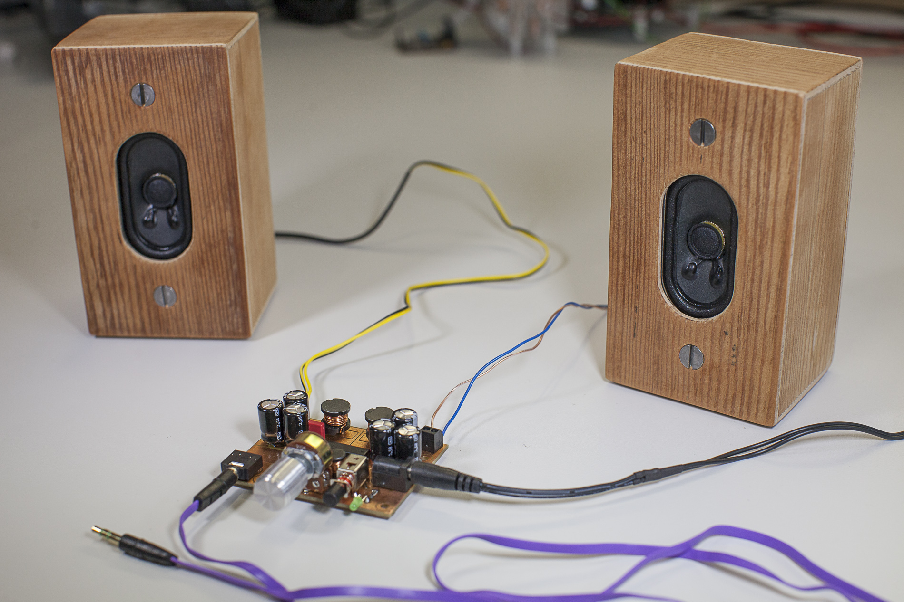

# class-D amplifier

This is a construction kit for a neat 2x5W class-D stereo amplifier.

## purpose
This kit was developed together with Thomas Voglhuber at the [Insitute for Microelectronics and Microsensors](http://www.ime.jku.at) at the Johannes Kepler University.

It is especially designed to be easy to solder even for beginners and may be used for workshops with students or trainees.

The kit provides all components (including power supply and a pair of speakers) that are necessary to build a cute homemade stereo system.

## technical details
The circuit is based on a TPA3125D2 chip with only a view minor extensions such as volume controll and a power switch. Due to the digital operation principle the amplifier reaches a good performance with very low power disspation. Although the circuit was designed for 16 Ohm speakers the chip and the circuit can easily handle even 4 Ohm speakers to gain more output power without the need of a heatsink.

The schematic and PCB layout was made using [KiCad](http://www.kicad-pcb.org/display/KICAD/KiCad+EDA+Software+Suite). The PCB layout was designed with respect to the basic rules of power electronics such as separation of power and signal current traces and keeping high frequency current traces as short as possible.

This is open hardware, so feel free to build, change and improve things!